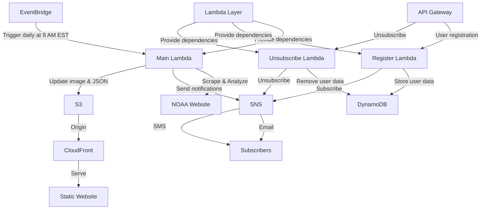

# Hurricane Control Center

Author: Dimitri Vavoulis

## Project Overview

The Hurricane Control Center is an advanced system that provides real-time monitoring and notifications about potential hurricane threats to users in Puerto Rico and Florida. It leverages NOAA data to analyze, visualize, and notify subscribers about approaching storms. The system is built using AWS services, demonstrating cloud architecture skills and the ability to create practical, user-focused applications. The core functionality runs daily at 8 AM EST to ensure up-to-date information.

Visit the live application at [www.hurricanecontrol.com](http://www.hurricanecontrol.com)

## Application Screenshot


*The Hurricane Control Center web interface, showing real-time hurricane threat information and user registration options.*

## Features

- Automated daily scraping of NOAA hurricane data at 8 AM EST
- Real-time analysis of potential threats to Puerto Rico and Florida
- User registration for location-based notifications
- User unsubscription functionality
- Automated email and SMS notifications via AWS SNS
- Daily update of NOAA 7-day forecast image
- Creation and update of a JSON summary for frontend display
- Efficient dependency management using AWS Lambda layers
- Scheduled daily execution using AWS EventBridge at 8 AM EST
- Secure data storage with AWS DynamoDB
- Scalable and cost-effective serverless architecture
- Content delivery via AWS CloudFront for improved performance and security

## Architecture



## Technical Stack

- **Frontend**: HTML, CSS, JavaScript
- **Backend**: AWS Lambda (Python)
- **Database**: AWS DynamoDB
- **Notification Service**: AWS SNS
- **API Gateway**: AWS API Gateway
- **Hosting**: AWS S3
- **Content Delivery**: AWS CloudFront
- **Scheduling**: AWS EventBridge (CloudWatch Events) - set for 8 AM EST daily execution
- **Dependency Management**: AWS Lambda Layers

## Key Components

1. **Main Lambda Function**: Core component that scrapes NOAA data, analyzes it, triggers notifications, updates the NOAA 7-day forecast image, and creates a JSON summary for the frontend. Executed daily at 8 AM EST.
2. **Register Lambda Function**: Handles user registration requests, stores user data in DynamoDB, and subscribes users to SNS topics.
3. **Unsubscribe Lambda Function**: Processes unsubscription requests, removes user data from DynamoDB, and unsubscribes users from SNS topics.
4. **Lambda Layer**: Contains external libraries (requests, beautifulsoup4) for efficient dependency management.
5. **EventBridge Rule**: Triggers the main Lambda function daily at 8 AM EST.
6. **DynamoDB Table**: Stores user subscription data and current hurricane threat information.
7. **SNS Topics**: Manage notifications for different locations.
8. **API Gateway**: Handles user registration and unsubscription requests.
9. **S3**: Hosts the static website content, NOAA 7-day forecast image, and JSON summary.
10. **CloudFront**: Distributes the website content globally, improving performance and providing additional security.

## Setup and Deployment

1. Clone the repository:
   ```
   git clone https://github.com/dimitrivavoulisportfolio/aws-hurricane-control-center.git
   ```

2. Set up AWS resources:
   - Create a DynamoDB table named `HurricaneNotificationUsers`
   - Set up SNS topics for Puerto Rico and Florida
   - Create Lambda functions for data scraping, user registration, and unsubscription
   - Configure API Gateway endpoints
   - Create a Lambda layer with the required libraries (requests, beautifulsoup4)
   - Set up an EventBridge rule to trigger the main Lambda function daily at 8 AM EST
   - Create an S3 bucket for static website hosting, NOAA image, and JSON summary
   - Set up a CloudFront distribution with the S3 bucket as the origin

3. Update the Lambda functions with your AWS account details and SNS topic ARNs.

4. Deploy the frontend:
   - Upload the `index.html` file to the S3 bucket configured for static website hosting
   - Ensure the CloudFront distribution is configured to serve the S3 bucket content

5. Configure your domain (hurricanecontrol.com) to point to the CloudFront distribution.

## Lambda Functions

### Main Lambda Function (hurricane-control-center-main-lambda.py)
This function is responsible for:
- Scraping NOAA data
- Analyzing it for potential threats
- Sending notifications to subscribers
- Updating the NOAA 7-day forecast image in S3
- Creating and updating a JSON summary in S3 for frontend display
It runs daily at 8 AM EST.

### Register Lambda Function (user-registration-function-lambda.py)
This function handles user registration:
- Receives user contact information and location preference
- Stores user data in DynamoDB
- Subscribes the user to the appropriate SNS topic

### Unsubscribe Lambda Function (unsubscribe-lambda-function.py)
This function processes unsubscription requests:
- Receives user contact information
- Removes user data from DynamoDB
- Unsubscribes the user from the SNS topic

## Lambda Layer Setup

1. Create a directory for your libraries:
   ```
   mkdir python
   pip install requests beautifulsoup4 -t python/
   ```

2. Create a zip file of the libraries:
   ```
   zip -r custom_layer.zip python
   ```

3. Create a new Lambda layer in the AWS Console and upload the `custom_layer.zip` file.

4. Attach the layer to your Lambda functions.

## CloudFront Configuration

1. Create a new CloudFront distribution in the AWS Console.
2. Set the S3 bucket as the origin.
3. Configure the distribution settings:
   - Enable HTTPS
   - Set up custom domain (www.hurricanecontrol.com)
   - Configure caching behavior
   - Set up geographic restrictions if needed
4. After creation, note the CloudFront domain name.
5. Update your DNS settings to point your custom domain to the CloudFront distribution.

## Local Development

1. Install the AWS CLI and configure it with your credentials.

2. Install the required Python packages:
   ```
   pip install boto3 requests beautifulsoup4
   ```

3. Use the AWS SAM CLI to test Lambda functions locally.

4. To test the scheduled event locally, you can use a JSON event file to simulate the EventBridge trigger for the 8 AM EST execution.

## Contributing

Contributions are welcome! Please fork the repository and submit a pull request with your changes.

## License

This project is licensed under the MIT License - see the [LICENSE](LICENSE) file for details.

## Contact

Dimitri Vavoulis - dimitrivavoulis3@gmail.com

Project Link: [https://github.com/dimitrivavoulisportfolio/aws-hurricane-control-center](https://github.com/dimitrivavoulisportfolio/aws-hurricane-control-center)

## Disclaimer

This project is not affiliated with NOAA. It uses publicly available NOAA data for educational and informational purposes only. The system performs its main operations daily at 8 AM EST to provide the most current information available.
